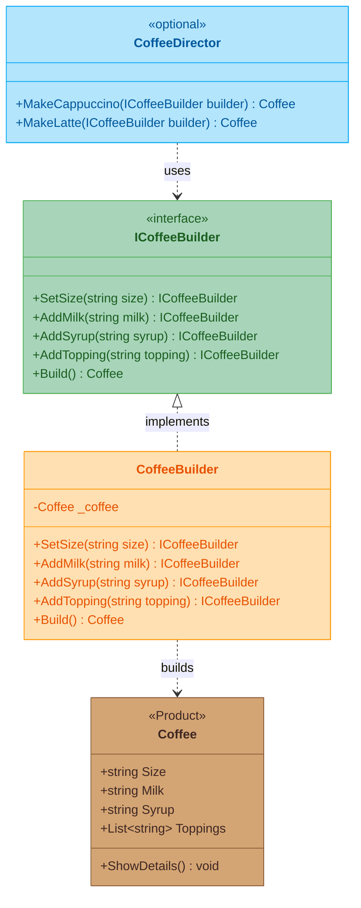

# Builder Pattern

## What Is It?

Builder is a **creational design pattern** that separates the **construction** of a complex object from its **representation**. It lets you build an object step by step — choosing size, milk, syrup, toppings — and produce different results using the same building process.

## The Coffee Shop Way

Ordering a custom coffee at a coffee shop is exactly this. You don't tell the barista "give me a large almond milk hazelnut coffee with chocolate chips and whipped cream" in one breath. You build it **step by step**: pick a size, choose your milk, add a syrup, pick toppings. The barista (builder) assembles your drink exactly as you described.

```
Barista:  SetSize("Large") → AddMilk("Almond") → AddSyrup("Hazelnut") → AddTopping("Chocolate Chips") → Build()
Result:   Your custom coffee, exactly as ordered
```

## The Problem

Some objects have many optional parts or configuration options. Using a constructor with tons of parameters is hard to read and error-prone. You end up with calls like `new Coffee("Large", "Almond", null, null, "Hazelnut", null, "Chocolate Chips")` — which argument is which?

## The Solution

Create a **builder** class with fluent methods — one for each part of the object. Each method returns the builder itself so you can chain calls. A final `Build()` method returns the finished product. Optionally, a **director** class encapsulates common recipes.

## Class Diagram



**How to read it:** `ICoffeeBuilder` defines the step-by-step interface. `CoffeeBuilder` implements each step and assembles a `Coffee`. `CoffeeDirector` (optional) wraps common recipes — it uses a builder internally so the client gets a preset drink without knowing the steps.

## Structure

| Role | Coffee Shop | Code |
|------|-------------|------|
| **Product** | The finished coffee | `Coffee` class |
| **Builder** | The barista's ordering checklist | `ICoffeeBuilder` interface |
| **Concrete Builder** | The barista assembling your drink | `CoffeeBuilder` class |
| **Director** | Menu presets (Cappuccino, Latte) | `CoffeeDirector` class |

## When to Use

- An object has many optional or configurable parts
- You want to avoid constructors with long parameter lists
- You need to create different representations using the same build process
- You want to enforce a step-by-step construction

## Key Idea

> **Build step by step.** Instead of one massive constructor, chain small methods — each handling one part — and call `Build()` when you're done.
