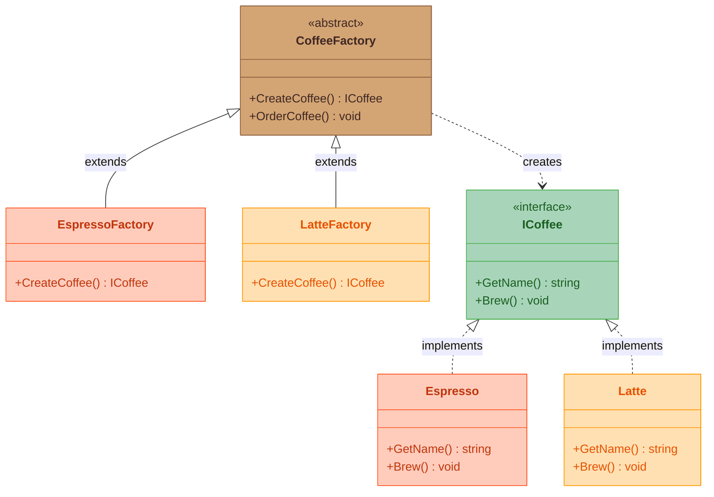

# Factory Method Pattern

## What Is It?

Factory Method is a **creational design pattern** that defines an interface for creating an object, but lets **subclasses decide which class to instantiate**. Instead of calling `new` directly, you call a method — and the subclass picks the concrete product.

## The Coffee Shop Way

Imagine a coffee shop franchise. Every branch follows the **same ordering process** — you walk up, place an order, and get your drink. But each branch *specializes* in a different drink. An **EspressoBar** always serves espresso, a **LatteBar** always serves latte.

The customer doesn't care *how* the drink is made — they just order. The branch (factory) decides what to create.

```
Customer → "I'll have a coffee" → EspressoBar → serves Espresso
Customer → "I'll have a coffee" → LatteBar    → serves Latte
```

## The Problem

You have a class that needs to create objects, but it shouldn't know **which specific class** to instantiate. You want subclasses to make that decision.

## The Solution

Define a method (`CreateCoffee`) in a base class that subclasses override to produce the object they want. The base class handles the shared logic; the subclass picks the concrete product.

## Class Diagram



**How to read it:** `CoffeeFactory` declares the factory method `CreateCoffee()`. Each concrete factory overrides it to return a specific coffee. The client only talks to `CoffeeFactory` — it never knows (or cares) which concrete product it gets.

## Structure

| Role | Coffee Shop | Code |
|------|-------------|------|
| **Product** | Any coffee drink | `ICoffee` interface |
| **Concrete Product** | Espresso, Latte | `Espresso`, `Latte` classes |
| **Creator** | Coffee factory (ordering process) | `CoffeeFactory` abstract class |
| **Concrete Creator** | EspressoBar, LatteBar | `EspressoFactory`, `LatteFactory` |

## When to Use

- A class can't anticipate which object it must create
- You want subclasses to choose what to instantiate
- You need to decouple client code from concrete classes

## Key Idea

> **Defer creation to subclasses.** The parent defines *how* to use an object; the child decides *which* object to create.
