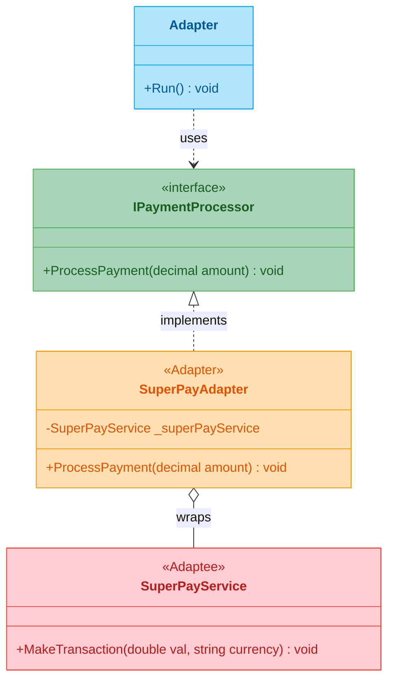

# Adapter Pattern

## What Is It?

Adapter is a **structural design pattern** that allows incompatible interfaces to work together. It acts as a bridge between two incompatible types by wrapping an existing class with a new interface that the client expects — without modifying the original class.

## The Coffee Shop Way

Your coffee shop's POS system uses `IPaymentProcessor` to handle payments. A popular third-party provider, **SuperPay**, has its own API — `MakeTransaction(amount, currency)` — which doesn't match your interface. You can't modify SuperPay's code, and you don't want to rewrite your POS. The solution? An **adapter** that wraps SuperPay and translates your `ProcessPayment(amount)` call into SuperPay's language.

```
POS (Client)  →  IPaymentProcessor.ProcessPayment(45000m)
                          ↓ (Adapter translates)
               SuperPayService.MakeTransaction(45000.0, "VND")
```

## The Problem

You have an existing class with a useful service, but its interface doesn't match what your code expects. You can't change the existing class (it's a third-party library or legacy code), and changing all client code to match would be expensive and error-prone.

## The Solution

Create an **adapter class** that:
1. Implements the interface your client expects (**Target**)
2. Holds a reference to the incompatible class (**Adaptee**)
3. Translates each call from the target interface into a call on the adaptee

The client only sees the target interface — it has no idea the adapter is doing translation work behind the scenes.

## Class Diagram



**How to read it:** The client uses `IPaymentProcessor`. `SuperPayAdapter` implements that interface and internally delegates to `SuperPayService`, converting `decimal` to `double` and adding the currency. The client never touches `SuperPayService` directly.

## Structure

| Role | Coffee Shop | Code |
|------|-------------|------|
| **Target** | The payment interface the POS expects | `IPaymentProcessor` interface |
| **Adaptee** | The third-party payment service | `SuperPayService` class |
| **Adapter** | The wrapper that translates calls | `SuperPayAdapter` class |
| **Client** | The POS system code | `Adapter.Run()` method |

## When to Use

- You want to use an existing class whose interface doesn't match what you need
- You need to integrate a third-party library without modifying its source code
- You want to create a reusable class that cooperates with unrelated or unforeseen classes

## Key Idea

> **Wrap and translate.** Don't change the incompatible class — build a thin adapter that converts one interface into another so they can work together seamlessly.
